# **README on Mcalibrator2**

<div>Created    : "2013-05-13 12:30:52 ban"</div>
<div>Last Update: "2018-02-01 17:43:18 ban"</div>

**********
# <a name = "Menu"> **Menu** </a>

- [Introduction – what is Mcalibrator2 ?](#Introduction)
- [System requirements](#System)
- [How to launch Mcalibrator2](#Launch)
- [How to generate/update html-based Mcalibrator2 help files](#Help)
- [Detailed manual of Mcalibrator2](#Manual)
  - [Aims and purposes](#Purposes)
  - [Installation](#Installation)
  - [Mcalibrator2 configuration - setting measurement/calibration parameters](#Configuration)
  - [Measure tab (you can measure CIE1931 xyY here)](#Measure)
  - [LUT tab - Running Gamma-correction and generating Color-LookUp tables (CLUTs)](#LUT)
  - [Chromaticity (CIE1931 xyY etc) estimation procedure](#Chromaticity)
  - [About tab](#About)
  - [How to make Mcalibrator2 communicate with your own colorimeter(s) or photometer(s)](#CustomColorimeter)
  - [How to add your own chromaticity estimation methods to Mcalibrator2](#CustomEstimation)
- [Automations and scripting of Mcalibrator2](#Scripting)
- [Acknowledgments](#Acknowledgments)
- [License](#License)
- [Citations](#Citations)
- [TODO](#TODO)

**********

# <a name = "Introduction"> **Introduction – what is Mcalibrator2 ?** </a>

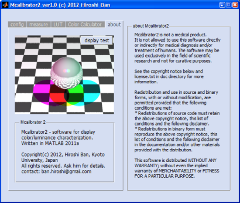    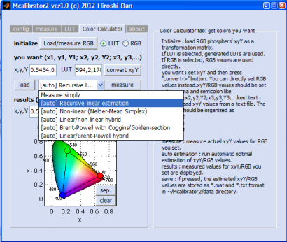  

Mcalibrator2 is a ***MATLAB***-based GUI display luminance and chromaticity characterization software package for visual neuroscience and psychology studies. The package is especially focusing on  
1. providing accurate gamma-correction, and  
2. finding the best RGB video inputs to produce the required CIE1931 xyY values using several goal-seeking optimization algorithms.  

(Matlab is a registered trademark of [***The Mathworks Inc.*** ](https://www.mathworks.com/) )

For details, please read documents in *~/Mcalibrator2/doc* directory.
Also please see the link below.

- [**Mcalibrator2 original website**](http://www.cv.jinkan.kyoto-u.ac.jp/site/mcalibrator/)
- [**Mcalibrator2 GitHub repository**](https://github.com/hiroshiban/Mcalibrator2)

The details of the algorithms we developed are described below.
- [**Original paper published in Journal of Vision, 2013**](http://www.journalofvision.org/content/13/6/20.long)

Thank you for using our software.  
We are happy if Mcalibrator2 can help your research projects.

[return to menu](#Menu)

# <a name = "System"> **System requirements** </a>

- **OS: Windows XP/VISTA/7/8 or Mac OSX**
  - note 1: Windows OS is required to use some photometers with Mcalibrator2 as only Windows drivers are distributed for them.
  - note 2: On a Mac OSX box, an interface to a virtual serial port is required (generally implemented by default).
  - note 3: We have not tested Mcalibrator2 on any Linux boxes. But it would work once you can get a proper serial or usb interface with a valid driver to control your photometer.

- **MATLAB R2009a** or later (We have tested the latest version with **R2014b** and **R2017a**), and "Optimization" and "Statistics" toolboxes
  - note 1: Mcalibrator2 works even without optimization/statistics toolboxes, but to use full functionality of the software (e.g. automatic non-linear RGB video input estimations), these toolboxes are required.
  - note 2: Mcalibrator2 can not be launched properly on MATLAB R2007 or older since the GUI handling system that we are using to control Mcalibrator2 windows is quite different from the conventions of the older MATLABs.

[return to menu](#Menu)

# <a name = "Launch"> **How to launch Mcalibrator2** </a>

To launch Mcalibrator on MATLAB, please run

```Matlab
>> Mcalibrator2
```

Please note that when you use MATLAB version 2012 or later, a function to control GUI tabs, "tabselectionfcn", will be disabled due to incompatibility of the function with the recent MATLAB.

[return to menu](#Menu)

# <a name = "Help"> **How to generate/update html-based Mcalibrator2 help files** </a>

Please run

```Matlab
>> update_Mcalibrator2_html_docs
```

Then, all the html-based help documents will be automatically generated in **~/Mcalibrator2/doc/html**.  
To read the help documents, please open **~/Mcalibrator2/doc/html/index.html** on your browser.

[return to menu](#Menu)

# <a name = "Manual"> **Detailed manual of Mcalibrator2** </a>

# <a name = "Purposes"> Aims and purposes </a>

Display characterization is an essential part of the experimental procedures in vision science because almost all current experiments are conducted in computer-aided environments: visual stimuli are manipulated via a programming language and displayed on a computer display, and observer’s responses are acquired by pressing keys connected to a computer. To ensure that visual stimuli – their luminance, color, timing, etc. are presented precisely in such computer-based experiments, researchers need to characterize display devices accurately in advance of actual experiments.  

CRT (Cathode Ray-Tube) displays are the most widely-used devices for current vision experiments, and the calibration procedures to characterize their luminance and chromaticities are well-established in the two-stage procedures: gamma-correction, followed by a linear color transformation (Berns et al., 1996; Brainard et al., 2002; Ban et al., 2006). The calibration results obtained through this standard two-step procedure has been tested (Brainard et al., 2002; Ban et al., 2006) and the quality of luminance and chromatic stimuli on CRT displays satisfy the researchers’ criterion.  

However, non-CRT devices such as a LCD (Liquid Crystal Display) and a DLP (Digital Light Processing) have come into the main stream recently and researchers are required to use non-CRT over CRT devices. There is no evidence that the standard display characterization method cannot be applied to these new types of devices since the current widely-used standard display calibration method is established based on the internal model of CRT devices.  

We have therefore developed a non-device-specific approach to display characterization. Specifically, our new methods use model-free gamma-correction procedure combined with a linear/non-linear (Nelder-Mead Simplex, Nelder & Mead, 1965; Dennis & Woods, 1987) hybrid or line search (Powell’s method with Coggins constrain, Powell, 1964; Brent, 1973; Press et al., 2007; Farhi, 2011; Farhi et al, 2012) algorithm to get the optimal RGB video input values to produce the required luminance and chromaticities. The methods only assume 1) a monotonic increment of luminance against the increment of video input values, and 2) a piece wise linearity of the system in the initial estimation step. These new methods have a much broader range of applicability because they do not presume the internal model of the display device and can handle non-linearity of the device.  

The whole procedures are integrated into a GUI-based display characterization software written in MATLAB (The Mathworks, Inc, USA) language and termed “Mcalibrator2” (Ban & Yamamoto, 2013). The applicability and efficiency of our software to a wide range of display devices, including LCD and DLP type of devices, were confirmed by comparing the calibration accuracies of our procedures with that of the standard two-stage method. We found that all of these new approaches improved calibration accuracies for non-CRT devices compared with the standard display characterization procedure.
Mcalibrator2 has provided some additional components to communicate with any photometers that researchers are using in their daily measurements. The software has also provided simple frameworks to add alternative chromaticity optimization procedures researchers may want to use. Further, the software can automatically generate gamma-correction tables compatible with Psychtoolbox, one of the most widely used vision science tools (Brainard, 1997; Pelli, 1997). These functions will assist researchers in characterizing their display devices.  

The authors provide this software suite in the hope that it will benefit researchers performing calibration of their display devices efficiently and improve accuracies of stimulus displays regardless of the display types.

***References***

1.	Ban, H., Yamamoto, H., Ejima, Y. (2006). Mcalibrator: MATLAB integrated GUI software for display calibration ― a proposal of a new color calibration procedure applicable to a wide range of display devices and evaluation of its efficiency ―. The Japanese Journal of Psychonomic Science. 24(2). 149-161.
2. Ban, H., & Yamamoto, H. (2013). A non-device-specific approach to display characterization based on linear, nonlinear, and hybrid search algorithms. Journal of Vision, 13(6):20, 1-26.
3.	Berns, R.S. (1996). Methods for Characterizing CRT Displays. Displays. 16, 173-182.
4.	Brainard, D.H. (1997). The psychophysics toolbox. Spatial Vision. 10, 433-436.
5.	Brainard, D.H., Pelli, D.G., Robson, T. (2002). Display Characterization. Encyclopedia of Imaging Science and Technology. Wiley, 172-188
6.	Brent, R.P. (1973). Section 7.3: Powell's algorithm. In Algorithms for minimization without derivatives. Englewood Cliffs, N.J.: Prentice-Hall.
7.	Dennis, J.E.Jr., Woods, D.J. (1987). New Computing Environments: Microcomputers in Large-Scale Computing. Edited by A. Wouk, SIAM, 116-122.
8.	Farhi, E. (2011). The iFit data analysis library, ILL, Computing for Science. Online reference: *http://ifit.mccode.org*
9.	Farhi, E., Debab, Y., Willendrup, P. (in press). Journal of Neutron Research.
10.	Nelder, J.A., Mead, R. (1965). A Simplex Method for Function Minimization. Computer Journal, 7, 308-313.
11.	Pelli, D.G. (1997). The video toolbox software for visual psychophysics: transforming numbers into movies. Spatial Vision. 10, 437-442.
12.	Powell, M. J. D. (1964). An efficient method for finding the minimum of a function of several variables without calculating derivatives. Computer Journal 7 (2): 155-162.
13.	Press, W.H., Teukolsky, S.A., Vetterling, W.T., Flannery, B.P. (2007). Section 9.3. Van Wijngaarden–Dekker–Brent Method. Numerical Recipes: The Art of Scientific Computing (3rd ed.). New York: Cambridge University Press.

[return to menu](#Menu)

# <a name = "Instration"> Installation </a>

1.	You need to install **MATLAB** ([***The Mathworks Inc.*** ](https://www.mathworks.com/)) to use Mcalibrator2.  
    You may additionally need to install **“Optimization"** and **"Statistics"** toolboxes to use all the functions of Mcalibrator2.
2.	Please get the latest version of Mcalibrator2 from the link below,  
    [**Mcalibrator2 GitHub repository**](https://github.com/hiroshiban/Mcalibrator2)  
    and add the *~/Mcalibrator2* directory to MATLAB-path. If you use MATLAB after 2011a, you do not need to add subdirectories.  
    Mcalibrator2 can handle all the subrouines internally.  
    If you use MATLAB before 2011a, please set MATLAB-path to the Mcalibrator2 including all the subdirectories.

3.  Please launch Mcalibrator2 from the MATLAB console,  
    
    ```Matlab
    >> Mcalibrator2
    ```

    Then, you will see the main window of Mcalibrator2 as below.

[return to menu](#Menu)

# <a name = "Configuration"> Mcalibrator2 configuration - setting measurement/calibration parameters </a>

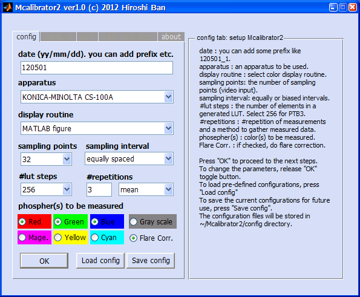  
**Mcalibrator2: config tab**

The “config” tab above is for setting measurement/calibration parameters.  

1.  You can set all the measurement/calibration parameters in this tab.  
    The details of the configuration parameters are described on the “Info” window.  
    After setting all the parameters, please press “OK” button.
    Then, all the parameters are saved and “measure”, “LUT”, “Color Calculator” tabs will be ready to be used.
2.	If you press “Save config” button, the current parameters will be saved under ***~/Mcalibrator2/config*** directory.  
    Yuo can load those parameters anytime with pressing “Load config” button.
3.	On the **[date]** editing window, you can set the data name as you like such as *yymmdd_1*, *yymmdd_2*, or *yymmdd_display1*, as well as *yymmdd* format.  
    When you need to calibrate a display device twice or more in a day, please change [date] names so that they are not overlapped.
4.	When you set a previous date on the **[date]** window, and if the corresponding data directory exists in ***~/Mcalibrator2/data***, you can load those previous data on memory.  

Next, you can proceed to measure RGB phosphor luminance values. Please go to “measure” tab.

[return to menu](#Menu)

# <a name = "Measure"> Measure tab (you can measure CIE1931 xyY here) </a>

  
**Mcalibrator2: measure tab**

You can set up a photometer and measure luminance values on this ***“measure”*** tab.  

First, please press “Adjust Colorimeter Position” button. Then, the grid window will be displayed on the screen. You can adjust and set a colorimeter focus using this window. The colorimeter position can be adjusted and validated anytime when you press the ***“Adjust Colorimeter Position”*** button. 

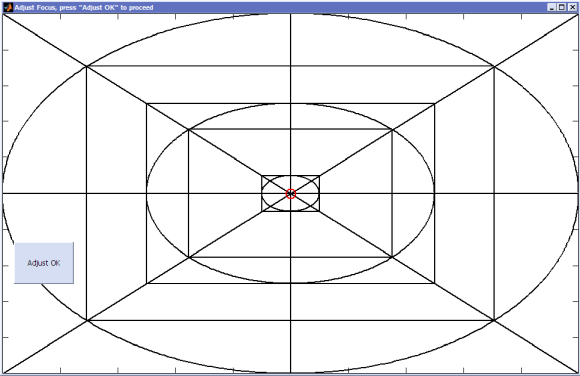  
**Mcalibrator2: adjustment of your colorimeter position**

Next, set an ID of the serial (or USB) port to which your colorimeter is connected. On Windows, the ID will be like ***COM1***, ***COM2***, …., on Linux, it will be like ***/dev/ttyS0***, and on Mac, it will be like ***/dev/tty.KeySerial1***.  
(***Please note that the authors have mainly tested Mcalibrator2 on Windows PC. We have not tested the software on Mac or Linux machines. Sorry***.)  
After setting the ID, please press ***“Create”*** button, and a serial (or USB) object to communicate with the colorimeter will be generated. Then, by pressing ***“Initialize Apparatus”*** button, the colorimeter will be initialized through the port.

The initial setups finished now. If you press ***“Measure CIE1931 xyY”*** button, the luminance values are measured against 32 (by default) video inputs for each of the RGB phosphors.  

After completing the measurements, the relationship between video input and luminance output values will be plotted as below.  

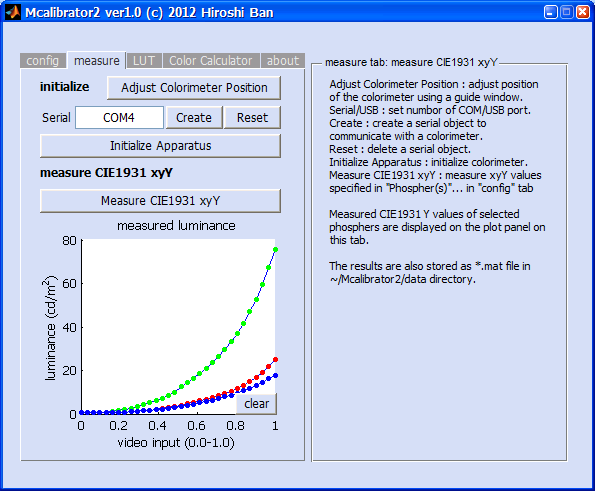  
**Mcalibrator2: measure tab after measurements**

The whole procedure on “measure” tab is completed now.  
Next, Mcalibrator2 is going to generate Color Lookup Tables (CLUTs) by linearizing the input/output relationship. Please go to ***“LUT”*** tab.

[return to menu](#Menu)

# <a name = "LUT"> LUT tab - Running Gamma-correction and generating Color-LookUp tables (CLUTs) </a>

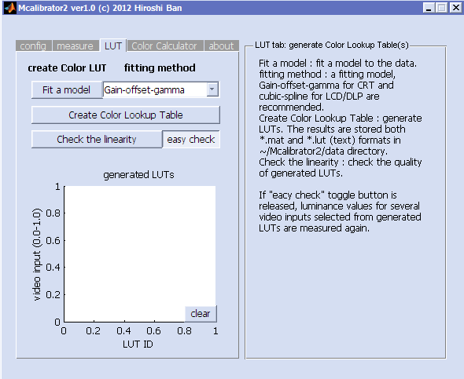  
**Mcalibrator2: LUT tab (performing gamma-correction and generating CLUTs)**

1.	Please select a fitting model to describe the input/output relationship.  
    - When you are using CRTs, ***“Gain-Offset-Gamma”*** (a well-known standard gamma-correction model) is recommended.
    - When you are using a LCD or DLP, ***“cubic spline”*** or ***“robust cubic spline”*** is recommended.  
    - If you select ***“grid search”*** , LUTs are generated by directly searching the best values,  
      but it will only work when you measure all 256 points (when you set #LUT step to 256 on an 8-bit phosphor).

  
**Mcalibrator2: Selecting a model for a gamma-correction**

2.	Please press ***“Fit a model”*** button, the selected model is fitted to the data and the results will be displayed on the ***“measure”*** tab.

  
**Mcalibrator2: Gamma-correction results**

3.	If the fitting results are fine, please press ***“Create Color Lookup Table”*** button.  
    CLUTs will be generated and saved to ***~/Mcalibrator2/data/(date etc)*** .
4.	The details of the measurements and the model fits (input/output relationship before/after gamma-corrections, LUTs, residuals of the fits etc.) will be plotted on the external figure windows. If you are running Mcalibrator2 on Windows in which ***Microsoft(C) PowerPoint*** is installed, these plots are saved into a PowerPoint slide file and stored to ***~/Mcalibrator2/data/(date etc.)*** automatically.
5.	You can repeat LUT-generation procedure by changing a fitting model until you can get the best results.

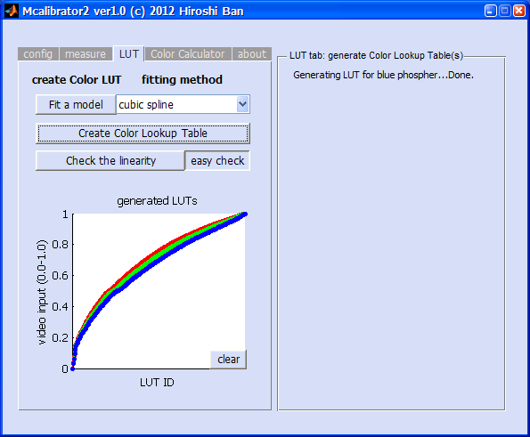  
**Mcalibrator2: LUT tab after generating CLUTs**

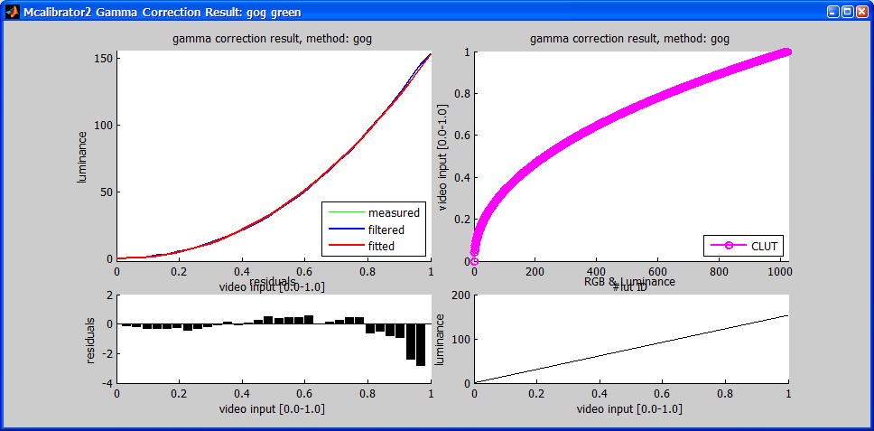  
**Mcalibrator2: Model fit result**

6.	To check how properly the Gamma-correction is performed, please press the ***“Check the linearity”*** button. When the ***“easy check”*** toggle button is ON (default), the generated CLUTs will be simply displayed on LUT tab. If it is set to OFF, luminance values for 20 video inputs (equally sampled from 0.0 to 1.0) are re-measured, and the linearity between the input video values and the output luminance are evaluated. If the results are not good, please re-generate CLUTs by changing a fitting model.  

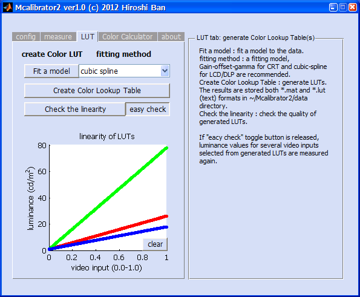  
**Mcalibrator2: Linearity test (Easy-check mode)**

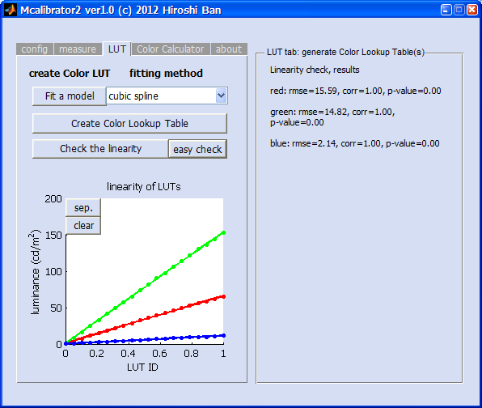  
**Mcalibrator2: Linearity test (Remeasuring mode)**

The whole procedures of gamma-correction and CLUT generations are completed. If you do not need to get optimal RBG video inputs to produce the specific chromaticities (CIE1931 xyY, not only Y (luminance)), the display characterization is done now.

If you need to perform chromaticity calibration, please go to ***“Color Calculator”*** tab below. 

[return to menu](#Menu)

# <a name = "Chromaticity"> Chromaticity (CIE1931 xyY etc) estimation procedure </a>

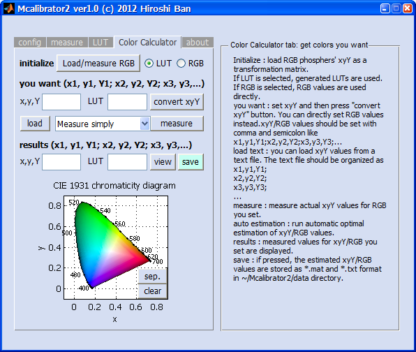  
**Mcalibrator2: Color Calculator tab (for performing chromaticity calibration)**

1.	First, to estimate chromaticity by a simple linear transformation, please load CIE1931 xyY values for each of the RGB phosphors at their maximum levels. To do this, please press the ***“Load/measure RGB”*** button. The phosphor values measured/stored in the previous session are extracted and displayed on the CIE1931 chromaticity diagram as 3 circles and a triangle. The range of chromaticity values you can present with the current display is a region enclosed by this triangle.

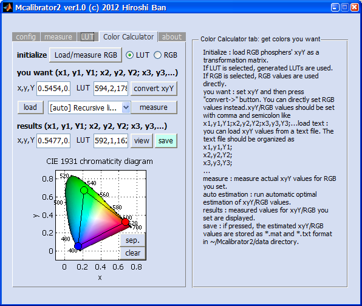  
**Mcalibrator2: Color Calculator tab after loading CIE1931 xy values of the RGB phosphors at their maximum level.**

2.	Then, if you want to use the CLUTs generated in the previous step, please set the ***LUT*** radio-button to ON (default). If you want to use the raw RGB values without the reference CLUTs, please set the ***RGB*** radio-button to ON. If the RGB radio-button is ON, you can directly set RGB values on the ***"you want to measure"*** edit box. Please use this option when you want to simply measure RGB values of your stimuli.
3.	Next, please input CIE1931 xyY values you want to use in your experiment on ***“x,y,Y”*** editing window just below the ***“you want (x1, y1, Y1; x2, y2, Y2; x3, y3,..)”*** message box. Please describe 3 (x, y, Y) values with a comma (,) as a delimiter. If you want to set multiple values, please use a semi-colon (;) to separate each of CIE 1931 xyY values. The format is thus as below.
**x1,y1,Y1; x2,y2,Y2; x3,y3,Y3;…**
4.	You can also load these CIE1931 xyY values from a text file. To do this, please press the ***“load”*** button. The CIE1931 xyY values in the text file should be described with commas and semi-colons as delimiters as below.  
***x1, y1, Y1;***  
***x2, y2, Y2;***  
***x3, y3, Y3;***  
***…***  
5.	After setting xyY values you want, please press ***“convert xyY”*** button. If the LUT radio-button is ON, the xyY values are converted to **CLUT IDs**. If the RGB radio-button is ON, the raw RGB values required are calculated by a simple linear transformation. The estimated values  are presented on the ***“LUT (or RGB)”*** edit box on the right side.
6.	To measure actual CIE1931 xyY values for these initial estimations, please press the ***“measure”*** button. The chromaticities for the estimated RGB values are successively measured. The results are presented on the ***“x,y,Y”*** and ***“LUT(or RGB)”*** edit boxes just below the ***“results (x1, y1, Y1; x2, y2, Y2; x3, y3,..)”*** message box. In addition, the CIE1931 xy values you want and the actual measures for the estimations are plotted on the ***“CIE1931 chromaticity diagram”*** window by a circle (what you want) and a cross (actual measurement). If these two values are close enough, the chromaticity calibration is done successfully.

  
**Mcalibrator2: Color Calculator tab, single color estimation result**

7.	If the estimations are not good, you need to adjut ***LUT IDs*** or ***RGB*** values by an automatic chromaticity estimation/correction method.
- Mcalibrator2 currently has 7 automatic chromaticity estimation methods;
  1. ***recursive linear estimations based on a least-squares method with random local-value samplings***,  
  2. ***recursive linear estimations based on a least-squares method with grid local-value samplings***,
  3. ***adjusting residuals by linear coeeficient estimations***,  
  4. ***a non-linear direct search algorithm --- Nelder-Mead Simplex***,  
  5. ***a linear/nonlinear hybrid estimation --- recursive linear estimations + Nelder-Mead Simplex***,  
  6. ***a line search algorithm --- Brent-Powell with Coggins/Golden-section***,  
  7. ***a linear/nonlinear hybrid estimation --- recursive linear estimations + Brent-Powell with Coggins/Golden-section***.  
  For more details of the estimation algorithms, please see comments on the source codes of Mcalibrator2 and see the paper on this software ([Ban and Yamamoto, 2013, Journal of Vision](http://www.journalofvision.org/content/13/6/20.long)). You can select one of these methods by using the dropdown-box next to the ***“measure”*** button. The estimation for one chromaticity will take 1-5 min. After finishing the estimations, the results are presented on the ***“x,y,Y”*** and ***“LUT(or RGB)”*** edit boxes just below the ***“results (x1, y1, Y1; x2, y2, Y2; x3, y3,..)”*** message. In addition, the CIE1931 xy values you want and the actual measured values for the estimations are plotted on the ***“CIE1931 chromaticity diagram”*** window by a circle (what you want) and a cross (actual measurement).

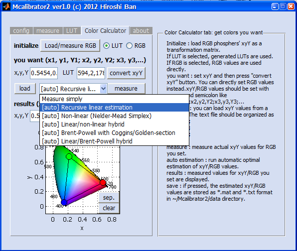  
**Mcalibrator2: Color Calculator tab, the dropdown-list for selecting a chromaticity estimation method**

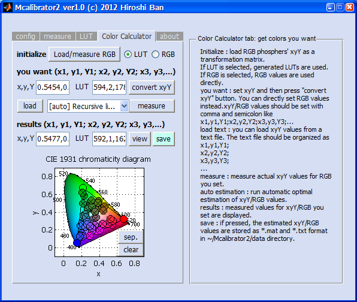  
**Mcalibrator2: Color Calculator tab, results of automatic chromaticity calibration (50 chromaticities)**

8.	To view the detailed chromaticity estimation values, please press the ***“view”*** button. The estimation results, residuals etc. are displayed on the MATLAB console window.
9.	To save the estimation results, please press the ***“save”*** button. The results are saved as a *.mat file to ***~/Mcalibrator2/data/(date etc.)*** like ***“estimate_files_001.txt”*** , ***“estimate_files_002.txt”*** ,… (file prefixex _001, _002,... are added automatically). Please be careful that ***no result will be saved automatically*** without pressing the ***“save”*** button.
10. If you can reproduce chromaticity values you want accurately enough, all the calibration procedures are completed. If the results are not good, please retry the estimations using different methods.

[return to menu](#Menu)

# <a name = "About"> About tab </a>

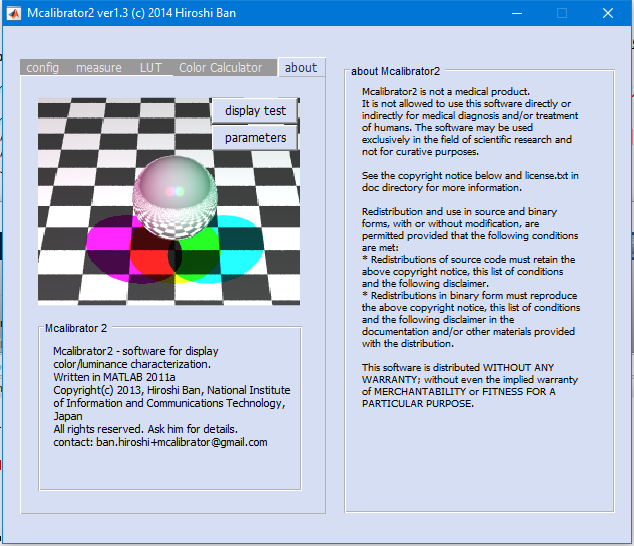  
**Mcalibrator2: about tab**

  
**Mcalibrator2: display test**

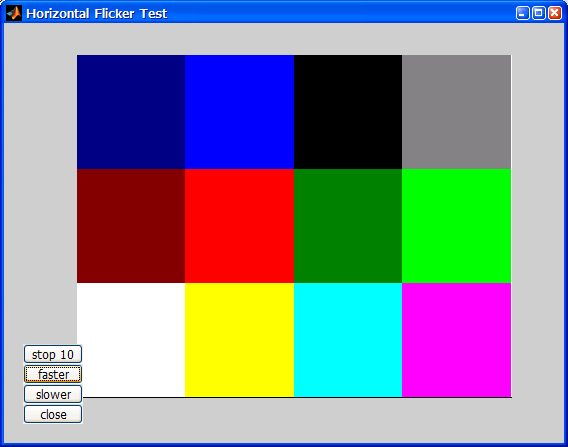  
**Mcalibrator2: color flickering test**

On the ***“About”*** tab, the details of Mcalibrator2 software packages are displayed. If you press the ***“display test”*** button on this tab, you can perform several simple display tests.  
Furthremore, by pressing the ***"parameters"*** button, you can change the detailed gamma-correction, LUT generation, and chromaticity estimation parameters as you like. ***However, changing those default values affect the performance and accuracies of the Mcalibrator2 functions. Please be careful.***

[return to menu](#Menu)

# <a name = "CustomColorimeter"> How to make Mcalibrator2 communicate with your own colorimeter(s) </a>

Currently, we have already prepared subrountines for Mcalibrator2 to communicate with  
- *Konica-Minolta CS-100A (tested),*  
- *Admesy Brontes-LL (tested),*  
- *Photo-research PR-650 (tested),*  
- *Cambridge Research Systems ColorCal2 (tested)*  
- *some more but NOT fully tested.*

You can also use your own colorimeter(s) with Mcalibrator2 if you write some simple codes in MATLAB. To do this, you need to  
1．Register your own colorimeter(s) to an apparatus-list file, and  
2．Create a class file which defines a MATLAB object for your own colorimeter to communicate with Mcalibrator2.

To register your colorimeter, please edit ***~/Mcalibrator2/subfunctions/colorimeter/colorimeter_list.m***
By default, several photometers are already registered as below in this file.

```Matlab
colorimeters{1}={'Photo Research PR-650','pr650',0};
colorimeters{2}={'KONICA-MINOLTA CS-100A','cs100a',0};
colorimeters{3}={'KONICA-MINOLTA CS-150','cs150',1};
colorimeters{4}={'Admesy Brontes-LL (64bit)','brontesLL',1};
colorimeters{5}={'Admesy Brontes-LL (32bit)','brontesLL32',1};
colorimeters{6}={'Cambridge Research Systems ColorCAL2 Win-USB','colorcal',1};
%colorimeters{7}={'Cambridge Research Systems ColorCAL2 (PTB, not tested)','colorcal2',1};
colorimeters{7}={'Cambridge Research Systems ColorCAL CDC (Virtual Port)','colorcalcdc',0};
colorimeters{8}={'Cambridge Research Systems OptiCal (not tested)','optical',0};
colorimeters{9}={'International Light IL1700','il1700',0};
colorimeters{10}={'Dummy Colorimeter (for Debug)','dummy_colorimeter',0};
```

Therefore, please add your colorimeter(s) as ***colorimeters{11}*** , ***colorimeters{12}*** ,….or you can fully re-write this list.  
The first variable is ***a name of your colorimeter displayed on Mcalibrator2***, the second variable is ***a name of a function for your colorimeter to communicate with Mcalibrator2 (= a class file name to generate MATLAB object)*** , and the third variable is ***a value (0/1) to specify the way of communication (0=serial connection, 1=USB connection)*** .

Then, please generate a MATLAB class file (*.m) which describes the details of the way of communication. Specifically, please define a MATLAB object with a “classdef” keyword. ***The communication object should have 2 properties and 4 methods described below***.

```
・Property (Hidden)
   portname,  
   rscom

・Property (public)
   init_flg

・Method
   gen_port,  
   reset_port,  
   initialize,  
   measure
```

Furthermore, in creating your own class, you have to use exactly the same input/output variables etc with the other communication objects.  
As examples, please see representative two objects below.  

1. ***Sample 1: ~/Mcalibrator2/subfunctions/colorimeter/cs100a.m (a serial communication)***  

```Matlab
classdef cs100a
  % a class to manipulate MINOLTA CS-100A from MATLAB through a serial port connection
  %
  % Created    : "2012-04-11 09:23:57 ban"
  % Last Update: "2016-09-13 18:19:02 ban"

  properties (Hidden) %(SetAccess = protected)
    portname='COM1'; % id of serial port to communicate with CS-100A
    rscom=[];  % serial port object
  end

  properties
    init_flg=0;
  end

  methods

    % constructor
    function obj=cs100a(port_name)
      if nargin==1 && ~isempty(port_name)
        obj.portname=port_name;
      end
    end

    % destructor
    function obj=delete(obj)
      if ~isempty(obj.rscom)
        fclose(obj.rscom);
        delete(obj.rscom);
        obj.rscom=[];
        obj.init_flg=0;
      end
    end

    % create/open a serial port connection to communicate with CS-100A
    function obj=gen_port(obj,port_name)
      if nargin>1 && ~isempty(port_name)
        obj.portname=port_name;
        obj.rscom=serial(obj.portname);
      elseif ~isempty(obj.portname)
        obj.rscom=serial(obj.portname);
      else
        error('set a name of serial port.');
      end

      set(obj.rscom,'DataBits',7,'BaudRate',4800,'Parity','even','StopBits',2,'Terminator','CR/LF');

      fopen(obj.rscom);

      % NEW for MATLAB R14
      % After initializing the serial port using FOPEN,
      % you should set the RTS and DTR pins to low using the following code:
      set (obj.rscom, 'DataTerminalReady' ,'off') ;
      set (obj.rscom, 'RequestToSend' ,'off') ;
      % and pause for some msec
      pause(0.3);

      % When the RTS and DTR pins are subsequently set high at any time using the following code,
      % the voltage at the pins will be as expected:
      set (obj.rscom, 'DataTerminalReady' ,'on') ;
      set (obj.rscom, 'RequestToSend' ,'on') ;

      obj.init_flg=1;
    end

    % reset a serial port connection
    function obj=reset_port(obj)
      fclose(obj.rscom);
      delete(obj.rscom);
      obj.rscom=[];
      obj.init_flg=0;
    end

    % initialize CS-100A
    function [obj,check,integtime]=initialize(obj,integtime)

      if isempty(obj.rscom), error('serial connection has not been established. run gen_port first.'); end

      % NOTICE 1
      %
      % First, you must confirm electric (electrical) power supply 'OFF'.
      % Then, press 'ON' button of the CS-100A, pushing 'F' key.
      % Check whether the character 'c' was shown on the bottom right corner of the CS-100A display.
      % Through these process, CS-100A will be set as bothway communications mode.

      % NOTICE 2
      % 'integtime' is a dummy variable to match the format with the other class.
      % It is not used in this function.

      fprintf(obj.rscom, 'MDS,07'); % Set Up Measurement Parameters.
      pause(0.1);

      % Checking setting parameters.
      results=fgets(obj.rscom);

      if ~strcmp(results(1:4),'OK00')
        disp('setup error. check CS-100A and cable connections.');
        return;
      end

      % Format -MDS
      %             'MDS,[][]'
      %               00 : MINOLTA Standard Calibration Mode
      %               01 : Optional Calibration Mode
      %               04 : Chromaticity Measurement Mode
      %               05 : Color Difference Measurement Mode
      %               06 : Measurement Response Time --- 100ms Fast Mode
      %               07 : Measurement Response Time --- 400ms Slow Mode

      % Error Check Command Description
      %               ER00 : Command Error, or Parameters Error
      %               ER11 : Memory Values Error
      %               ER20 : EEPROM Error
      %               ER30 : Battely Out Error

      fprintf(obj.rscom, 'MDS,04'); % Set Up Measurement Parameters.
      pause(0.1);

      % Checking setting parameters.
      results=fgets(obj.rscom);

      if strcmp(results(1:4),'OK00')
        check = 0;
      else
        check = 1;
      end
    end

    % measure CIE1931 xyY of the target
    function [qq,Y,x,y,obj]=measure(obj,integtime)

      if isempty(obj.rscom), error('serial connection has not been established. run gen_serial first.'); end
      if nargin<2 || isempty(integtime), integtime=500; end %#ok

      % NOTICE 1
      % Terminator (delimiter) should be CR/LF (CR+LF).
      % This terminator was set by CreateSerialObjectMINOL.

      % NOTICE 2
      % 'integtime' is a dummy variable to match the format with the other class.
      % It is not used in this function.

      fprintf(obj.rscom, 'MES'); % Measure Light Under Conditions defined by the 'MDS' command line.
      pause(0.1);

      % Format -MES
      %       output : normal
      %                   'OK00,+[][][][][][],+.[][][][],+.[][][][]'
      %                     notice : here, + may chage to -
      %              : luminance and chromaticity over the measurement range
      %                   'ER10'
      %              : chromaticity over the measurement range
      %                   'OK11,+[][][][][][],+.0000,+.0000'
      %                     notice : here, + may chage to -
      %              : luminance over the measurement range
      %                   'OK12,-999999,+.[][][][],+.[][][][]'
      %                     notice : here, + may chage to -
      %              : values are over the display or maasurement range
      %                   'ER12'
      %              : luminance under the masurement range
      %                   'OK13,+[][][][][][],+.[][][][],+.[][][][]'
      %                     notice : here, + may chage to -

      results=fscanf(obj.rscom);
      %if strcmp(results(1:4),'OK00')
        qq=0;
        Y=str2num(results(6:12)); %#ok
        x=str2num(results(14:19)); %#ok
        y=str2num(results(21:26)); %#ok
        return
      %end

      % numretry=1; qq=1;
      % while numretry<=5 && qq~=0
      %   numretry=numretry+1;
      %   if strcmp(results(1:4),'OK00')
      %     Y=str2num(results(6:12)); %#ok
      %     x=str2num(results(14:19)); %#ok
      %     y=str2num(results(21:26)); %#ok
      %     qq=0;
      %   else
      %     if strcmp(results(1:4),'OK12')
      %       fprintf(obj.rscom, 'MDS,06'); % fast mode
      %       fscanf(obj.rscom); % clear data
      %     elseif strcmp(results(1:4),'OK13')
      %       fprintf(obj.rscom, 'MDS,07'); % slow mode
      %       fscanf(obj.rscom); % clear data
      %     end
      %     pause(0.1);
      %     fprintf(obj.rscom, 'MES');
      %     pause(0.1);
      %     results=fscanf(obj.rscom);
      %   end
      % end
      %
      % if numretry>5
      %   Y=str2num(results(6:12)); %#ok
      %   x=str2num(results(14:19)); %#ok
      %   y=str2num(results(21:26)); %#ok
      % end

      % Descriptions
      % qq                  : Measurement quality code (OK00 = O.K.)
      % U                   : Unit of Measured Luminace, always 0 with CS-100A
      % Y                   : +(-)[][][][][][] 1931 CIE Y (units indicated by U)
      % x                   : +(-).[][][][] 1931 CIE x
      % y                   : +(-).[][][][] 1931 CIE y
    end

  end % methods

end % classdef cs100a
```


2. ***Sample 2: ~/Mcalibrator2/subfunctions/colorimeter/brontesLL.m (a USB communication)***

```Matlab
classdef brontesLL
  % a class to manipulate Admesy Brontes-LL from MATLAB on Windows OS via a USB port
  %
  % [methods]
  % brontesLL=brontesLL.gen_port('PORT')             : generate USB port to communicate with Brontes-LL
  % brontesLL=brontesLL.initialize(integration_time) : initialize measurement parameters
  % brontesLL=brontesLL.reset_port()                 : reset USB port connection
  % [qq,Y,x,y,brontesLL]=brontesLL.measure(integration_time) : measure CIE1931 xyY
  % command=brontesLL.write('command')               : send command to Brontes-LL through USB connection
  % results=brontesLL.read(number_of_bytes)          : read resutls etc from Brontes-LL through USB connection
  %
  % [requirement]
  % 1. NI-VISA (National Instruments) or lib_usb_win32 driver
  % 2. Admesy_sdk.zip distributed by Admesy, Netherlands
  %
  % [how to use]
  % To use this class on Windows OS with Admesy BrontesLL, please first install
  % Admesy SDK distributed by Admesy, Netherlands.
  % After installing the sdk, please copy three files below
  % ~/Admesy SDK/libraries/libusbtmc/bin/x64/libusbtmc_x64.dll
  % ~/Admesy SDK/libraries/libusbtmc/bin/x86/libusbtmc_x86.dll
  % ~/Admesy SDK/libraries/libusbtmc/include/libusbtmc.h
  % to the same directory with this class file.
  %
  % [license details about Admesy SDK]
  % Admesy SDK license agreement
  % By installing the Admesy SDK, you agree to the following terms.
  % 1)	The Admesy SDK can be used freely with Admesy instruments with no limitations regarding installation.
  % 2)	Use of this library with other brands instruments is not permitted.
  % 3)	This library is not licensed to third parties without the use of Admesy Instruments.
  % 4)	Distribution of the files is only permitted with Admesy instruments or demo software.
  % Distributions should always include this end-user license.
  % 5)	Modifications/renaming of DLL’s are not permitted.
  % 6)	Functions that are exported but undocumented, are not supported.
  % 7)	This Admesy License agreement does not contain any 3th party licenses such as Labview,NI-Visa
  %     or Microsoft Visual Studio. 3th party software may require a separate license agreement.
  % 8)	Libusbtmc can be used in conjunction with libusb. This does not require a separate license.
  % 9)	The library is not distributed with source code. It is not open source, but free to use.
  % 10)	The Admesy colour SDK is developed for use on the Windows Operating system (XP32bit, Vista, Win7,
  %     Win8) and with general hardware in mind. Admesy does not guarantee full functionality on all operating
  %     systems/hardware. Admesy Instruments can be operated on Linux and Mac OSX or other Operating systems,
  %     but that is not supported by this SDK.
  % 11)	This SDK and its components are free to use under above terms and may not be sold to 3rd parties.
  %
  %
  % Created    : "2012-10-29 05:28:07 ban"
  % Last Update: "2017-06-30 10:17:52 ban"

  properties (Hidden) %(SetAccess = protected);
    % id of USB port to communicate with Brontes-LL. This is a dummy variable to match with the other function
    portname='USB0::0x1781::0x0E98::00032::INSTR';
    rscom=[];  % serial port object. This is a dummy variable to match with the other function
    deviceID='';
    devicehandle=0;
    TIME_OUT=5000; % time out of the communication in msec
  end

  properties
    init_flg=0;
  end

  methods

    % constructor
    function obj=brontesLL(port_name)
      if ~libisloaded('usbtmc')
        if strfind(computer('arch'),'64') % if working on a 64-bit machine
          %notfound=loadlibrary('libusbtmc_x64.dll',@admesy_libusbtmc_matlab,'alias','usbtmc');
          notfound=loadlibrary('libusbtmc_x64.dll','libusbtmc.h','alias','usbtmc');
        else % if working on a 32-bit machine.
          %notfound=loadlibrary('libusbtmc_x86.dll',@admesy_libusbtmc_matlab,'alias','usbtmc');
          notfound=loadlibrary('libusbtmc_x86.dll','libusbtmc.h','alias','usbtmc');
        end
        if ~isempty(notfound)
          if strfind(computer('arch'),'64') % if working on a 64-bit machine
            error('library: libusbtmc_x64.dll & libusbtmc.h not found. check input variable.');
          else % if working on a 32-bit machine.
            error('library: libusbtmc_x86.dll & libusbtmc.h not found. check input variable.');
          end
        end
      end
      if nargin==1 && ~isempty(port_name)
        obj.portname=port_name;
      end
    end

    % destructor
    function obj=delete(obj)
      obj.rscom=[];
      obj.init_flg=0;
      if obj.devicehandle~=0, calllib('usbtmc','usbtmc_close',obj.devicehandle); end
      unloadlibrary('usbtmc');
    end

    % create/open a USB port connection to communicate with Brontes-LL
    function obj=gen_port(obj,port_name) %#ok
      % port_name is a dummy variable to match nargin with the other functions
      if obj.init_flg==1
        disp('USB connection with Brontes-LL is already established');
      else
        disp('starting USB communication with Brontes-LL');

        % find Brontes-LL device with its ID
        usbtmcdevices=libpointer('stringPtr',repmat(' ',1,255));
        [dummy,obj.deviceID]=calllib('usbtmc','usbtmc_find_devices',usbtmcdevices);
        clear usbtmcdevices;
        if obj.deviceID==0
          warning('USB communication can not be established. check cable connection'); %#ok
          obj.init_flg=0;
        else
          % open USB port
          [dummy,obj.deviceID,obj.devicehandle]=calllib('usbtmc','usbtmc_open',obj.deviceID,0);
          if obj.devicehandle==0
            error('USB port not opend. check cable connection');
          end
          obj.init_flg=1;
        end

      end
    end

    % reset a serial port connection
    function obj=reset_port(obj)
      obj.rscom=[];
      obj.init_flg=0;
      calllib('usbtmc','usbtmc_close',obj.devicehandle);
      obj.deviceID='';
      obj.devicehandle=0;
      [dummy,obj.deviceID,obj.devicehandle]=calllib('usbtmc','usbtmc_open',obj.deviceID,0);
    end

    % initialize Brontes-LL
    function [obj,check,integtime]=initialize(obj,integtime)
      if nargin<=2 || isempty(integtime), integtime=40000; end
      integtime=min(integtime,500000);
      integtime=max(5000,integtime);

      check=0;
      try
        % reset & clear the device
        [dummy,obj.devicehandle]=calllib('usbtmc','usbtmc_write',obj.devicehandle,':*RST',obj.TIME_OUT);
        [dummy,obj.devicehandle]=calllib('usbtmc','usbtmc_write',obj.devicehandle,':*CLS',obj.TIME_OUT);

        % set gain
        [dummy,obj.deviceID]=calllib('usbtmc','usbtmc_write',obj.devicehandle,':SENSE:GAIN 1',obj.TIME_OUT);

        % set num of samples to be averaged
        [dummy,obj.devicehandle]=calllib('usbtmc','usbtmc_write',obj.devicehandle,':SENSE:AVERAGE 10',obj.TIME_OUT);

        % set integration time in usec
        [dummy,obj.devicehandle]=calllib('usbtmc','usbtmc_write',obj.devicehandle,sprintf(':SENSE:INT %d',integtime),obj.TIME_OUT);

        % set sampling band width
        [dummy,obj.devicehandle]=calllib('usbtmc','usbtmc_write',obj.devicehandle,':SENSE:SBW small',obj.TIME_OUT);
      catch %#ok
        check=1;
      end
    end

    % measure CIE1931 xyY of the target
    function [qq,Y,x,y,obj]=measure(obj,integtime)

      if ~obj.init_flg, disp('initialization has not completed. open port and initialize the apparatus first.'); return; end
      if nargin<2 || isempty(integtime), integtime=20000*2; end
      integtime=min(integtime,500000);
      integtime=max(5000,integtime);

      qq=1; counter=0;
      while qq~=0 && counter<5
        counter=counter+1;
        if counter>2
          if qq>0
            integtime=min(ceil(integtime*0.8),5000);
          elseif qq<0
            integtime=min(ceil(integtime*1.2),5000000);
          end
          [dummy,obj.devicehandle]=calllib('usbtmc','usbtmc_write',obj.devicehandle,sprintf(':SENSE:INT %d',integtime),obj.TIME_OUT);
        end

        % [about output format of measured CIE1931 xyY]
        %
        % :MEASure command return their result in ASCII formated floating point as shown below :
        % (Y,x,y,clip,noise) ?ｨ %f,%f,%f,%d,%d\n;
        %
        % The integration time setting can be varied from 0.5ms to 5s.
        % It is specified in μs. Results from the Brontes-LL colorimeter include a clip and noise
        % indication which indicate whether the measured light is too bright (clip) or too low (noise).
        % When clipping is detected, the resulting colour will not be correct and a lower integration time
        % should be chosen. When noise is detected, a larger integration time should be chosen.

        [dummy,obj.devicehandle]=calllib('usbtmc','usbtmc_write',obj.devicehandle,':meas:YXY',obj.TIME_OUT);
        bytecount=64;
        data_ptr=libpointer('uint8Ptr',zeros(1,bytecount));

        % [Note from Admesy SDK manual about the use of Bytecount]
        %
        % The third input variable of usbtmc_read is Bytecount.
        % The number of bytes that needs to be read may exceed the actual data that is available.
        % However, assigning always a very large number is discouraged.
        % For example when a “:meas:XYZ” command returns 36 bytes, you may ask for 64 bytes.
        % When you use a “:sample:Y” function, you know exactly how many bytes should be returned.
        % It is than best to input this exact number or just a little bit more.
        % In case you read for example 65535 bytes for a “:meas:XYZ: command, the internal library
        % allocates 65535 bytes where it only gets 36bytes back. This works, but is inefficient in
        % memory and execution time.

        [dummy,obj.devicehandle,measured]=calllib('usbtmc','usbtmc_read',obj.devicehandle,data_ptr,uint32(bytecount),obj.TIME_OUT);
        clear data_ptr;

        val=sscanf(char(measured),'%f,%f,%f,%d,%d\n');
        if sum(measured)~=0
          if numel(val)~=0
            Y=val(1);
            x=val(2);
            y=val(3);
            clip=val(4);
            noise=val(5);
            qq=0;
            %if clip, qq=1; end
            %if noise, qq=-1; end
            %if clip==0 && noise==0, qq=0; end
          else
            qq=1; Y=[]; x=[]; y=[];
          end
        else
          if numel(val)>4
            if val(4)==0
              warning('the measured light is too bright'); %#ok
            elseif val(5)==0
              warning('the measured light is too dark'); %#ok
            end
          else
            warning('measuring failed. check the cable connection'); %#ok
          end
          qq=1; Y=[]; x=[]; y=[];
        end
      end
    end

    % write command to Brontes-LL through USB connection
    function [obj,command]=write(obj,command)
      calllib('usbtmc','usbtmc_write',obj.devicehandle,command,obj.TIME_OUT);
    end

    % read results etc from Brontes-LL through USB connection
    function [obj,results]=read(obj,bytecount)
      if nargin<2 || ismepty(bytecount), bytecount=128; end
      data_ptr=libpointer('uint8Ptr',zeros(1,bytecount));
      [dummy,obj.devicehandle,results]=calllib('usbtmc','usbtmc_read',obj.devicehandle,data_ptr,uint32(bytecount),obj.TIME_OUT);
      results=char(results);
      clear data_ptr;
    end

  end % methods

end % classdef brontesLL
```

After completing these setups, please launch Mcalibrator2, check whether your own colorimeter is properly registered (if registered, your apparatus is listed in the dropdown-list on ***“config”*** tab), and check whether your colarimeter can communicate with Mcalibrator2.

[return to menu](#Menu)

# <a name = "CustomEstimation"> How to add your own chromaticity estimation methods to Mcalibrator2 </a>

You can easily add your own chromaticity estimation procedure(s) to Mcalibrator2 as you like. To do this, please  
１．Register your own estimation method(s) to a list of estimation-method file, and
２. Create MATLAB function(s) which describe your own chromaticity estimation procedure(s).

To register your own chromaticity estimation method(s) to Mcalibrator2, please edit ***~/Mcalibrator2/subfunctions/colorcalculator/measurement_method_list.m***.  
By default, eight chromaticity estimation methods are already registered in this file as below.

```Matlab
meas_methods{1}={'Measure simply','calculator_measure_simply'};
meas_methods{2}={'[auto] Recursive linear estimation with unifrnd()','calculator_auto_estimation_linear'};
meas_methods{3}={'[auto] Recursive linear estimation with Grid','calculator_auto_estimation_linear_grid'};
meas_methods{4}={'[auto] Adjust residuals by linear coefficients','calculator_auto_estimation_lincoeff'};
meas_methods{5}={'[auto] Non-linear (Nelder-Mead Simplex)','calculator_auto_estimation_nonlinear'};
meas_methods{6}={'[auto] Linear/non-linear hybrid','calculator_auto_estimation_hybrid'};
meas_methods{7}={'[auto] Brent-Powell with Coggins/Golden-section','calculator_auto_estimation_powell'};
meas_methods{8}={'[auto] Linear/Brent-Powell hybrid','calculator_auto_estimation_powell_hybrid'};
```

Please add your method(s) as ***meas_methods{9}*** , ***meas_methods{10}*** ,…, or you can fully rewrite the list. The first variable is ***a name of your estimation method displayed on Mcalibrator2***, the second variable is ***a name of the estimatin function***.  

You have to separately create a MATLAB function, which defines the details of your own chromaticity estimation procedure, and have to save it with the same name with the second varialbe in the list. The function should be located in ***~/Mcalibrator2/subfunctions/colorcalculator/*** directory.  

Furtheremore, the function should have the ***three input variables*** listed below and have ***no output variable***.

```
hObject    : A handle to Mcalibrator2 Objects.  
             Generally this variable is not used, but it is
             required to follow MATLAB GUI handling conventions.
eventdata  : A variable booked for a future version of MATLAB.
             This variable is also not used currently, but it is
             required to adjust a format with the other default
             functions of Mcalibrator2.
handles    : A structure which includes handles to child objects
             of Mcalibrator2 and user-defined data
```

In addition, please declare the global variables below in your function with a “global” keyword.

```Matlab
global confiｇ;             % a structure which stores configuration of Mcalibrator2
global colorimeterhandler; % an object to handle a colorimeter
global displayhandler;     % an object to present a chromaticity on display
global phosphers;          % CIE1931 xyY values of RGB phosphors at their maximum levels
global flares;              % Flares (zero-level luminance) of RGB phosphers
```

By using the global variables above and the input variable, “handles”, you can manipulate Mcalibrator2 through your own chromaticity estimation function.  

For examples, please see
1. ***~/Mcalibrator2/subfunctions/colorcalculator/calculator_auto_estimation_linear.m***
2. ***~/Mcalibrator2/subfunctions/colorcalculator/calculator_auto_estimation_hybrid.m***

[return to menu](#Menu)

# <a name = "Scripting"> **Automations and scripting of Mcalibrator2** </a>

Almost all the display characterization procedures of Mcalibrator2 have been provided as individual MATLAB functions and they are found in ***~/Mcalibrator2/subfunctions directory***. Therefore, you can easily extract a part of the procedures implemented in Mcalibrator2
and use it in your own characterization routines.

Here, I will introduce some MATLAB code examples on how to acces and use the sub-routines of Mcalibrator2. Hope these samples can help your daily display characterization for your research projects.

1. ***Sample 1: run gamma-correction with CRS ColorCAL2***  
   (You can find the source in ***~/Mcalibrator2/scripting_samples/gamma_correction_ColorCAL.m***)

```Matlab
function [lut,xyY]=gamma_correction_ColorCAL(mes_steps,fit_method,num_repeats)

% A sample script to perform display gamma-correction by yourself without Mcalibrator2 GUI window.
% function [lut,xyY]=gamma_correction_ColorCAL(:mes_steps,:fit_method,:num_repeats)
% (: is optional)
%
% A simple script to perform display gamma-correction (grayscale only) using
% Cambridge Research Systems ColorCAL MK2 via a USB connection.
% When you customize the sub-routine to display color patches (DisplayColorWindow),
% you can interact with Psychtoolbox, ViSaGe, or BITS#.
%
% [how to use]
% 1. connect ColorCAL MK2 to computer with a USB cable
% 2. launch MATLAB (32-bit) and go to this directory
% 3. run the gamma-correction script on MATLAB
%    >> lut=gamma_correction_ColorCAL(32)
% 4. results is stored in 'gamma_correction_YYMMDD.mat' file
%
% [input]
% mes_steps   : measurement steps. 32 by default.
%               luminance measurement will be performed for video input values
%               defined by linspace(0.0,1.0,mes_steps)
% fit_method  : method to create gamma table, 'cbs' by default.
%               one of 'gog','cbs','rcbs','pow','pow2','log','lin', 'poly', 'sig', or 'sg'
%               currently, supported methods are
%               'gog'  : gain-offset-gamma model, exponential, based on CRT's internal model
%               'cbs'  : cubic spline
%               'rcbs' : robust cubic spline
%               'pow'  : power function
%               'pow2' : diff of 2 power functions
%               'log'  : 5th order polynomial fit in log space
%               'lin'  : linear interpolation
%               'poly' : 5th order polynomial fit
%               'sig'  : sigmoid function
%               'wbl'  : Weibull function
%               'gs'   : grid search with robust spline
%                        only valid when numluttbl==length(lum)
%               'gog (gain-offset-gamma model)' by default
%               'cbs (cubic spline)' is also recommneded if the display is LCD, DLP, or EL
%               For details, please see ApplyGammaCorrection.m
% num_repeats : the number of repetitions of the measurements, 1 by default.
%
% [output]
% lut        : the generated Color LookupTable. [1 x 256] matrix.
% xyY        : measured xyY values for each of video input intensities.
%              [4(video input value, x, y, Y) x mes_step] matrix.
%
%
% Created    : "2012-10-31 16:15:32 ban"
% Last Update: "2013-12-18 11:15:35 ban"

% check input variables
if nargin<1 || isempty(mes_steps), mes_steps=32; end
if nargin<2 || isempty(fit_method), fit_method='cbs'; end
if nargin<3 || isempty(num_repeats), num_repeats=1; end

% add path to Mcalibrator2 subfunctions
addpath(genpath(fullfile(pwd,'..','subfunctions')));

% generate directory to save the results
save_dir=fullfile(pwd,'results');
if ~exist(save_dir,'dir'), mkdir(save_dir); end

% initialize ColorCAL
device=colorcal;
device=device.gen_port();
device=device.initialize();

% display color window for adjusting colorimeter position
fullscr_flg=1;
fig_id=DisplayColorWindow(999,fullscr_flg);

disp(' ');
disp('*******************************************************************');
disp('adjust colorimeter position and press OK, then press F5 to proceed.');
disp('*******************************************************************');
disp(' ');
keyboard;

% set colors and mask
colors={'red','green','blue','gray'};
colormask={[1,0,0],[0,1,0],[0,0,1],[1,1,1]};

% initializing xyY data structure
xyY=cell(length(colors),1);
for ii=1:1:length(colors)
  xyY{ii}=zeros(4,mes_steps); % 4 = video-input-values, CIE1931 x, CIE1931 y, and CIE1931 Y.
  xyY{ii}(1,:)=linspace(0.0,1.0,mes_steps);
end

% light measurements, alternatively you can use MeasureCIE1931xyYs function implemented in Mcalibrator2.
for ii=1:1:length(colors)
  fprintf('measuring luminance/chromaticity for %s...',colors{ii});
  tmpx=zeros(num_repeats,mes_steps); tmpy=zeros(num_repeats,mes_steps); tmpY=zeros(num_repeats,mes_steps);
  for rr=1:1:num_repeats
    for nn=1:1:mes_steps
      fig_id=DisplayColorWindow(repmat(xyY{ii}(1,nn),1,3).*colormask{ii},fullscr_flg,fig_id);
      [dummy,tmpY(rr,nn),tmpx(rr,nn),tmpy(rr,nn),device]=device.measure();
    end
  end
  xyY{ii}(2:4,:)=[mean(tmpx,1);mean(tmpy,1);mean(tmpY,1)];
  clear tmpx tmpy tmpY;
  disp('done.');
end

% close color window and release a persistent variable to control figure
DisplayColorWindow(-999,fullscr_flg,fig_id);

% apply gamma-correction to the measured data
lutnum=256; monotonic_flg=1; lowpass_flg=0; flare_correction_flg=1; display_flg=1; save_flg=0;
lut=cell(length(colors),1);
for ii=1:1:length(colors)
  fprintf('generating gamma-table for %s...',colors{ii});
  lut{ii}=ApplyGammaCorrection(xyY{ii}([1,4],:),fit_method,lutnum,monotonic_flg,lowpass_flg,flare_correction_flg,display_flg,save_flg);
  movefile(fullfile(pwd,sprintf('gamma_corr_result_%s.png',fit_method)),...
           fullfile(save_dir,sprintf('gamma_corr_result_%s_%s.png',fit_method,colors{ii})));
  disp('done.');
end

% save phosphor xyY as [rx,gx,bx;ry,gy,by;rY,gY,bY]
phosphors=[xyY{1}(2:4,end),xyY{2}(2:4,end),xyY{3}(2:4,end)];

% save the measurement resutls
fprintf('saving the data...');
savefname=fullfile(save_dir,sprintf('gamma_correction_%s.mat',datestr(now,'yymmdd')));
save(savefname,'colors','colormask','lut','xyY','phosphors');
disp('done.');

% remove path to Mcalibrator2 subfunctions
rmpath(genpath(fullfile(pwd,'..','subfunctions')));

return
```

2. ***Sample 2: run auto chromaticity estimation with CRS ColorCAL2***  
   (You can find the source in ***~/Mcalibrator2/scripting_samples/auto_color_estimation_ColorCAL.m***)

```Matlab
function estimate=auto_color_estimation_ColorCAL(xyY_want,lut,phosphors)

% A sample script to run the recursive-linear automatic color estimation by yourself without Mcalibrator2 GUI window.
% function estimate=auto_color_estimation_ColorCAL(xyY_want,lut,:phosphors)
% (: is optional)
%
% A simple script to run the recursive-linear automatic color estimation procedure developed
% by H.Ban and H.Yamamoto, using Cambridge Research Systems ColorCAL MK2 via a USB connection.
%
% The details of the algorithm is described in
% Ban, H., & Yamamoto, H. (2013).
% A non-device-specific approach to display characterization based on linear, nonlinear, and hybrid search algorithms.
% Journal of Vision, 13(6):20, 1-26, http://www.journalofvision.org/content/13/6/20, doi:10.1167/13.6.20.
%
% [how to use]
% 1. connect ColorCAL MK2 to computer with a USB cable
% 2. launch MATLAB (32-bit) and go to this directory
% 3. run the auto-calibration script on MATLAB
%    >> estimate=auto_color_estimation_ColorCAL(xyY_want,lut);
% 4. results is stored in 'auto_estimation_YYMMDD.mat' file
%
% [input]
% xyY_want   : xyY values we want, [3 x n] matrix
% lut        : color lookup table, [n x 3(r,g,b)] matrix, set lut=[]; if you do not need to use LUTs
% phosphors  : phosphor xyY, [rx,gx,bx;ry,gy,by;rY,gY,bY] (RGB) at max voltage level of the display
%
% [output]
% estimate   : cell structure {n x 1}, holding the estimation results with the variables below
%              .method --- 'LUT' or 'RGB
%              .wanted_xyY
%              .measured_xyY
%              .residuals --- measured_xyY minus rawxyY
%              .rms --- error
%              .RGB --- RGB values for all the estimations
%              .LUT --- lut index if .method='LUT'
%              .final_xyY --- the final estimation of xyY
%              .final_RGB --- the final estimation of RGB
%              .final_LUT --- the final estimation of LUT
%
%
% Created    : "2013-12-11 13:15:17 ban"
% Last Update: "2013-12-18 11:18:17 ban"

% check input variables
if nargin<3, help(mfilename()); return; end

if size(xyY_want,1)~=3, error('xyY_want shold be [3(x,y,Y) x n] matrix. check input variable.'); end
if size(lut,2)==1, lut=repmat(lut,1,3); end
if size(phosphors,1)~=3 || size(phosphors,2)~=3, error('phosphors should be [rx,gx,bx;ry,gy,by;rY,gY,bY](3 x 3) matrix. check input variable.'); end

% if lut is empty, generating a linear one
if isempty(lut), lut=repmat(linspace(0.0,1.0,256),[3,1])'; end

% add path to Mcalibrator2 subfunctions
addpath(genpath(fullfile(pwd,'..','subfunctions')));

% generate directory to save the results
save_dir=fullfile(pwd,'results');
if ~exist(save_dir,'dir'), mkdir(save_dir); end

% initialize ColorCAL
device=colorcal;
device=device.gen_port();
device=device.initialize();

% set display handler
displayhandler=@DisplayColorWindow;

% set options for the recursive linear estimation of RGB video inputs to produce your xyY values
options.iteration=5;
options.samples=18;
options.rsmerror=1; % percent error. the estimation will be terminated when the error is less than this value.
options.ss0=2.0; % search space, from ss0 to ss1
options.ss1=1.0;

% run the recursive linear estimation
% you can also select one from the other algorithms implemented in Mcalibrator2 or your own procedures.
fprintf('optimizing RGB video inputs to produce xyY you want...');
estimate=AutoColorEstimateLinear(xyY_want,xyY_want,phosphors,[],lut,device,displayhandler,options);
disp('done.');

% plotting
fprintf('Plotting estimated accuracies on the CIE1931 diagram...');
PlotCIE1931xy([],phosphors,-1,0,1);
for mm=1:1:size(xyY_want,2)
  hold on;
  PlotCIE1931xy(xyY_want(1:2,mm),phosphors,0,1,1,1);
  PlotCIE1931xy(estimate{mm}.final_xyY(1:2),phosphors,0,1,1,0);
end
disp('done.');

% save the measurement resutls
fprintf('saving the results...');
savefname=fullfile(save_dir,sprintf('auto_estimation_%s.mat',datestr(now,'yymmdd')));
save(savefname,'estimate');
disp('done.');

% remove path to Mcalibrator2 subfunctions
rmpath(genpath(fullfile(pwd,'..','subfunctions')));

return
```

3. ***Sample 3: measure RGB phosphors with Admesy BrontesLL***  
   (You can find the source in ***~/Mcalibrator2/scripting_samples/measure_RGBphosphors_brontes.m***)

```Matlab
function [Phosphor,white,flare,mcolors,mcolors_str]=measure_RGBphosphors_brontes(out_fname,integtime,nrepeat)

% A sample script to measure CIE1931 xyY for RGB video input values by yourself without Mcalibrator2 GUI window.
% function [Phosphor,white,flare,mcolors,mcolors_str]=measure_RGBphosphors_brontes(:out_fname,:integtime,:nrepeat)
% (: is optional)
%
% A simple script to measure RGB phosphor chromaticities (at the maximum voltage level)
% using Admesy brontes-LL photometer through a USB connection.
%
% [how to use]
% 1. connect Brontes-LL to computer with a USB cable
% 2. launch MATLAB (32-bit) and go to this directory
% 3. run the measurement script on MATLAB
%    >> measure_RGBphosphors_brontes('your_output_file_name')
% 4. results is stored in 'your_output_file_name' file
%
% [input]
% out_fname  : output file name, e.g. 'left_projector.mat', 'phosphor.mat' by default
% integtime  : integration time in usec, 20000 by default
% nrepeat    : the number of repetitions, 5 by default
%
% [output]
% Phosphor   : RGB phosphor xyY, 3x3 matrix. [Rx,Gx,Bx;Ry,Gy,By;RY,GY,BY]
% white      : CIE1931 xyY for white (RGB=[255,255,255]), [wx;wy;wY]
% flare      : CIE1931 xyY for black (RGB=[  0,  0,  0]), [kx;ky;kY]
% mcolors={[1,0,0],[0,1,0],[0,0,1],[1,1,1],[0,0,0]}; (fixed in this function for simplicity)
% mcolors_str={'red  ','green','blue ','white','black'}; (fixed in this function for simplicity)
%
% [note on chromaticity unit conversion]
%
% Once you get phosphor (and white & flare) matrix, you can convert RGB video input values
% to the corresponding CIE1931 xyY (XYZ, Lab, uv) chromaticity values.
% (To do chromatictiy unit conversion, add path to 'subfunction' directory first)
%
% For example, when the target pixel RGB values are RGB=[255,100,64],
%
% 1. to convert RGB pixel values to CIE1931 xyY
% >> xyY = RGB2xyY(RGB./255,Phosphor,[]); % recommended
% or
% >> xyY = RGB2xyY(RGB./255,Phosphor,flare);
%
% 2. to convert xyY to XYZ
% >> XYZ = xyY2XYZ(xyY);
%
% 3. to convert XYZ to Lab (using a Psychtoolbox function)
% >> Lab = lab=XYZToLab(XYZ,xyY2XYZ(white));
%
% 4. to convert xy to uv (using a Psychtoolbox function)
% >> xy = xyY(1:2);
% >> uv = xyTouv(xy,0);
%
%
% Created    : "2012-10-31 16:15:32 ban"
% Last Update: "2013-12-18 11:15:29 ban"

% check input variable
if nargin<1 || isempty(out_fname), out_fname='phosphor.mat'; end
if nargin<2 || isempty(integtime), integtime=20000; end
if nargin<3 || isempty(nrepeat), nrepeat=5; end

if ~strcmp(out_fname(end-3:end),'.mat'), out_fname=[out_fname,'.mat']; end

% add path to Mcalibrator2 subfunctions
addpath(genpath(fullfile(pwd,'..','subfunctions')));

% generate directory to save the results
save_dir=fullfile(pwd,'results');
if ~exist(save_dir,'dir'), mkdir(save_dir); end

% initialize Brontes-LL
device=brontesLL;
device=device.gen_port('USB0::0x1781::0x0E98::00032::INSTR');
device=device.initialize(integtime);

% display color window for adjusting colorimeter position
fullscr_flg=1;
fig_id=DisplayColorWindow(999,fullscr_flg);

disp(' ');
disp('*******************************************************************');
disp('adjust colorimeter position and press OK, then press F5 to proceed.');
disp('*******************************************************************');
disp(' ');
keyboard;

% measure RGB
mcolors={[1,0,0],[0,1,0],[0,0,1],[1,1,1],[0,0,0]};
mcolors_str={'red  ','green','blue ','white','black'};
Y=zeros(nrepeat,length(mcolors)); x=zeros(nrepeat,length(mcolors)); y=zeros(nrepeat,length(mcolors));
fprintf('\nmeasuring display chromaticities...\n\n');
for nn=1:1:nrepeat
  for cc=1:1:length(mcolors)
    fig_id=DisplayColorWindow(mcolors{cc},fullscr_flg,fig_id);
    [qq,Y(nn,cc),x(nn,cc),y(nn,cc),device]=device.measure(integtime);
  end
end

% display measured values
Y=mean(Y,1); x=mean(x,1); y=mean(y,1);
for cc=1:1:length(mcolors)
  fprintf('%s: CIE1931 xyY = (%f,%f,%f)\n',mcolors_str{cc},x(cc),y(cc),Y(cc));
end

% close color window and release a persistent variable to control figure
DisplayColorWindow(-999,fullscr_flg,fig_id);

% RGB phosphor chromaticity, [Rx Gx Bx; Ry Gy By; RY GY BY]
Phosphor=[x(1),x(2),x(3);y(1),y(2),y(3);Y(1),Y(2),Y(3)];

% plotting measured xy values in CIE1931 chromaticity diagram
new_fig_flg=1; tri_flg=1; color_flg=1; marker_type=1;
PlotCIE1931xy([x(4);y(4)],Phosphor,new_fig_flg,tri_flg,color_flg,marker_type);
white=[x(4);y(4);Y(4)];
flare=[x(5);y(5);Y(5)];

% save the measured resutls
fprintf('saving the results...');
save(fullfile(save_dir,out_fname),'Phosphor','white','flare','mcolors','mcolors_str');
disp('done.');

% remove path to Mcalibrator2 subfunctions
rmpath(genpath(fullfile(pwd,'..','subfunctions')));

return
```

[return to menu](#Menu)

# <a name = "Acknowledgments"> **Acknowledgments** </a>

Mcalibrator2 uses several MATLAB functions distributed by someones directly or modified versions of them. The details are listed as below.
We greatly appreciate for their contributions. We also clearly denote that our Mcalibrator2 suite fulfills all the license requirements to use these tools.

- ***For creating GUI window***  
  **tabpanel**     : Elmar Tarajan  
                 [ref] [http://www.mathworks.com/matlabcentral/fileexchange/6996-tabpanel-constructor-v2-8-2010](http://www.mathworks.com/matlabcentral/fileexchange/6996-tabpanel-constructor-v2-8-2010)

- ***For creating html documents***  
  **m2html**       : Guillaume Flandin  
                 [ref] [http://www.artefact.tk/software/matlab/m2html/](http://www.artefact.tk/software/matlab/m2html/)

- ***For transforming chromatic values across different units and spaces***  
  *We appreciate the developer of this tool. The CIE1931 color disk on the Color Calculator tab of Mcalibrator2 was generated based on this tool.*  
  **optprop**      : Jerker Wagberg  
                 [ref] [http://www.mathworks.com/matlabcentral/fileexchange/13788-optprop-a-color-properties-toolbox](http://www.mathworks.com/matlabcentral/fileexchange/13788-optprop-a-color-properties-toolbox)

- ***For filtering raw luminance data***  
  **smoothn**      : Damien Garcia  
               [ref] Garcia D, Robust smoothing of gridded data in one and higher dimensions with missing values. Computational Statistics & Data Analysis, 2010.  
               [ref] [http://www.mathworks.com/matlabcentral/fileexchange/725-smoothn](http://www.mathworks.com/matlabcentral/fileexchange/725-smoothn)  
  
  **splinefit**    : Jonas Lundgren  
               [ref] [http://www.mathworks.com/matlabcentral/fileexchange/13812-splinefit](http://www.mathworks.com/matlabcentral/fileexchange/13812-splinefit)

- ***For non-linear estimation of RGB values to produce CIE1931 xyY we want***  
  **fminsearchOS** : Olivier Salvado  
                 [ref] Jeffrey C. Lagarias, James A. Reeds, Margaret H. Wright, Paul E. Wright, "Convergence Properties of the Nelder-Mead Simplex Method in Low Dimensions", SIAM Journal of Optimization, 9(1): p.112-147, 1998.  
                 [ref] [http://www.mathworks.com/matlabcentral/fileexchange/5157-fminsearch-modifed-for-higher-scale-smooth-function](http://www.mathworks.com/matlabcentral/fileexchange/5157-fminsearch-modifed-for-higher-scale-smooth-function)

- ***For very effective optimization/estimation of RGB values to produce CIE1931 xyY we want***  
  **iFit toolbox** : E. Farhi et al.  
                 [ref] [http://ifit.mccode.org/index.html](http://ifit.mccode.org/index.html)

- ***For maximizing figure window using Windows API when Mcalibrator2 is running on Windows OS***  
  **WindowAPI**    : Jan Simon  
                 [ref] [https://jp.mathworks.com/matlabcentral/fileexchange/31437-windowapi](https://jp.mathworks.com/matlabcentral/fileexchange/31437-windowapi)

- ***The tool below is not included in Mcalibrator2; you need to install it separately.***  
   *(Mcalibrator2 can communicate with Psychtoolbox if it is installed.)*

   **Psychtoolbox** : The individual Psychtoolbox core developers,  
               (c) 1996-2011, David Brainard  
               (c) 1996-2007, Denis Pelli, Allen Ingling  
               (c) 2005-2011, Mario Kleiner  
               Individual major contributors:  
               (c) 2006       Richard F. Murray  
               (c) 2008-2011  Diederick C. Niehorster  
               (c) 2008-2011  Tobias Wolf  
               [ref] [http://psychtoolbox.org/HomePage](http://psychtoolbox.org/HomePage)

[return to menu](#Menu)

# <a name = "License"> **License** </a>

Mcalibrator2 --- MATLAB software for display luminance/color characterization  
Copyright (c) 2013, Hiroshi Ban, Kyoto University, and National Institute of Information and Communications Technology, Japan.  
All rights reserved.

Redistribution and use in source and binary forms, with or without modification, are permitted provided that the following conditions are met:

    * Redistributions of source code must retain the above copyright
      notice, this list of conditions and the following disclaimer.
    * Redistributions in binary form must reproduce the above copyright
      notice, this list of conditions and the following disclaimer in
      the documentation and/or other materials provided with the distribution

THIS SOFTWARE IS PROVIDED BY THE COPYRIGHT HOLDERS AND CONTRIBUTORS "AS IS" AND ANY EXPRESS OR IMPLIED WARRANTIES, INCLUDING, BUT NOT LIMITED TO, THE IMPLIED WARRANTIES OF MERCHANTABILITY AND FITNESS FOR A PARTICULAR PURPOSE ARE DISCLAIMED. IN NO EVENT SHALL THE COPYRIGHT OWNER OR CONTRIBUTORS BE LIABLE FOR ANY DIRECT, INDIRECT, INCIDENTAL, SPECIAL, EXEMPLARY, OR CONSEQUENTIAL DAMAGES (INCLUDING, BUT NOT LIMITED TO, PROCUREMENT OF SUBSTITUTE GOODS OR SERVICES; LOSS OF USE, DATA, OR PROFITS; OR BUSINESS INTERRUPTION) HOWEVER CAUSED AND ON ANY THEORY OF LIABILITY, WHETHER IN CONTRACT, STRICT LIABILITY, OR TORT (INCLUDING NEGLIGENCE OR OTHERWISE) ARISING IN ANY WAY OUT OF THE USE OF THIS SOFTWARE, EVEN IF ADVISED OF THE POSSIBILITY OF SUCH DAMAGE.

[return to menu](#Menu)

# <a name = "Citations"> **Citations of Mcalibrator2** </a>

If you have spaces in "References" section of your research papers, please allow us to ask you to cite the article below.
If you have no space, please cite somewhere someday next time...Thank you so much.

1. ***Ban, H., & Yamamoto, H. (2013).***  
**A non-device-specific approach to display characterization based on linear, nonlinear, and hybrid search algorithms.**  
Journal of Vision, 13(6):20, 1-26, http://www.journalofvision.org/content/13/6/20, doi:10.1167/13.6.20.

2. ***Ban, H., Yamamoto, H., & Ejima, Y. (2006).***  
**Mcalibrator: MATLAB integrated GUI software for display calibration - A proposal of a new color calibration procedure
applicable to a wide range of display devices and evaluation of its efficiency.**  
Japanese Journal of Psychonomic Science, 24, 149-161.

[return to menu](#Menu)

# <a name = "TODO"> **TODO** </a>

1. Adding some more interfaces to communicate with the other colorimeters (Suppots from someones are always really welcome. Thank you).
2. Updating Mcalibrator2 PDF manuals using the latest GUI window figures.
3. Compiling *.m files using the MATLAB compiler so that we can provide a standalone verion of the Mcalibrator2 package.

[return to menu](#Menu)